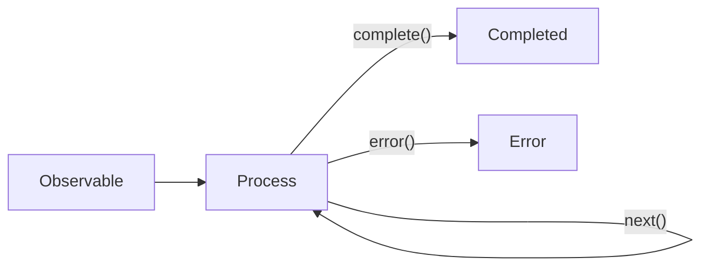

# 3 - Observable & Observer

---

# What is an Observable and Observer?


<!-- 
1. 什么事Observalbe和Observer呢。
2. 简单理解，当我们在收看电视节目的时候， 电视台是数据源， 它决定了何时以及如何播放节目， 我们付费订阅了节目通过电视机来接收的节目信息。 那在这个流程中电视台就是Observable，电视机就是Observer。
3. 这是观察者模式的一种应用， 在一个持续产生事件的系统中，采用分而治之的思想来进行功能分割， 让被观察者（Observable）只关心如何以及何时发布数据，而观察者(Observer)只关注如何处理数据。

-->
---

# Create Observable

Example Link: 
https://stackblitz.com/edit/dysnp7?devtoolsheight=50&file=index.ts

```ts {}
import { Observable } from 'rxjs';

const observable = new Observable(function subscribe(subscriber) {
  try {
    subscriber.next(1);
    subscriber.next(2);
    subscriber.next(3);
    subscriber.complete();
  } catch (err) {
    subscriber.error(err); // delivers an error if it caught one
  }
});
```

<!-- 
1. 那如何创建一个Observable, 很简单，只需要new一个Observable对象即可，并且定制好它发送数据的行为。
2. 在这个例子中，Observable对象会发送三个数据出去， 1,2,3 然后调用 complete()方便表示这个Observable对象完结，也就是不会再发送数据出去了。
3. 我们还可以看到，Observable在发送数据时，还会捕获异常，如果有异常发生，那就调用error()方法来表示这个Observable对象异常状态完结。
4. 这个例子中，很简单，不会有异常发送，但是在实际项目组中，会有很多抛出异常的场景。
5. 那这个例子，也同时展示了， Observable的三种状态。
-->
---

# Observable Status


<!-- 
1. 从图中，我们可以看到Observable共有三种状态
2. process: 这种状态是Observable正处于发送数据的状态中，对应到前一个例子中的 next() 1 2 3 的调用。
   a. next()方法有两个作用，一个是提醒Observable对象它自己还是在process状态，
   b. 同时通知Observer对象，数据发送给你了， 你看着处理这些数据吧。
3. completed: 这种是Observable正常完结状态，对应到前一个例子中就是所有的数据都通过next()发送完毕。
   a. complete()方法有两个作用，一个是告知Observable对象它自己是完结状态了，自己的活已经干完了。
   b. 同时通知Observer对象，告诉它，数据都发完了，不会再有新的数据了，你可以做下收尾工作了。
4. error: 这种Observable异常完结状态，对应前一个例子中就是捕获到异常了，调用error()方法。
   a. error()方法有两个作用，一个是告知Observable对象它自己是异常完结状态了，不用再发送数据了，有故障了。
   b. 同时通知Observer对象，告诉它，我这边有故障了，我把错误信息给你，你自己也应对一下这错误吧。
5. 注意是Observable只能有一种完结状态，一旦完结后， 它是不会再给之前订阅过它的observer发送数据了。
-->

---

# Observer

https://stackblitz.com/edit/wspzmb?devtoolsheight=50&file=index.ts

```ts {}
const observer = {
  next: (x) => console.log('Observer got a next value: ' + x),
  error: (err) => console.error('Observer got an error: ' + err),
  complete: () => console.log('Observer got a complete notification'),
};

const onSubscribe = observable.subscribe(observer);
onSubscribe.unsubscribe();
```
<!-- 
1. observer就是一个观察者，观察observable发送的数据，那如何将observable和observer关联上呢
2. 就是通过observable的subscrible方法，这个方法的参数就是接收一个observer对象，进行关联。
3. 关联后，observer是如何接受到来自observable的信息呢，这就得看下observer对象中必须定义的三个方法。我们刚才已经提到了observable有三种状态，observerable在做状态切换的时候就会调用observer对象的这三个方法，将所有状态的数据发送给observer对象。但是这三个方法在接受到状态数据后，到底要如何处理它们， 那需要开发人员根据具体项目的业务逻辑去定制化行为。
   a.next()
   b.error()
   c.complete()

3. 我们可从例子中看出，在observer去订阅observable对象之前，observable对象是不会发送数据给observer对象的，它只是预定好了数据发送的行为但不会真正发送出去。但是当订阅上后，数据才发送出来。这是复合我们的预期的，数据发送后，需要有观察者对这个数据有兴趣才有意义，如果还没有观察者呢，那数据就不应该被发送出来。市场经济，都是按需生成产品的，如果没有消费者，那这些商品就不应该被生成出来。
4. 大家可能好奇，为什么还有一个unsubscribe方法呢。 开发人员应该根据业务逻辑，当observer明明已经不再需要出来数据了，那就应该告诉observable一声，咱俩解除绑定关系吧，你不用再给我发送数据了。 这么做的意义是，往往observable是需要花费很大力气才能产生这些数据，然后发送出来，这需要占用很多的计算机资源， 有了这种机制，就可以避免计算资源的浪费。从而能够提高应用程序的性能，而有更好的用户体验。
-->
