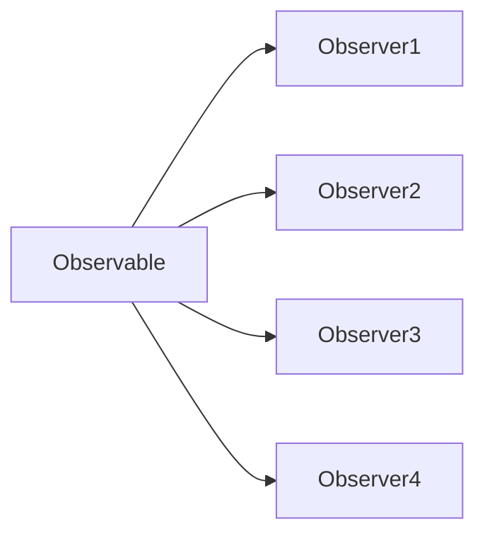
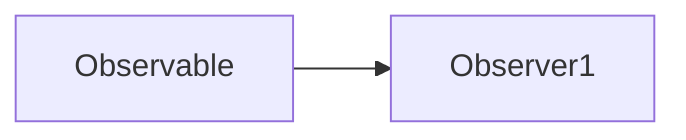

<template v-slot:default>

# Multicast

</template>
<template v-slot:right>

 # Unicast

</template>

<!-- 
1. 多播就是同一个observable对象同时被多个observer对象订阅
2. 单播就是一个observable对象只有一个observer对象订阅
3. 从我们之前做的例子中，可以看出，只要调用一次observable对象的subscribe方法就可以让一个observer对象订阅它，就能实现多播，那调用多次subscribe方法，就能实现多个observer对象的订阅，那这就是实现了多播吗？
4. 答案是不一定
   a. 多播必须是针对同一数据源的订阅，并且不论每个订阅者订阅的先后顺序，它们都应该在同一个数据流中接收到一致的广播信息。
5. 从这个角度去看rxjs的observerable，就可以看出，hot observable是天然支持多播的，但是cold observable就不是，因为每个不同的observer每次订阅的时候，cold observable都会新建出来一套全新的数据流给每个订阅。
6. 那在有些业务场景下，我们需要对cold observable实现真正的多播，那如何做到呢。 答案就是使用subject。
-->
