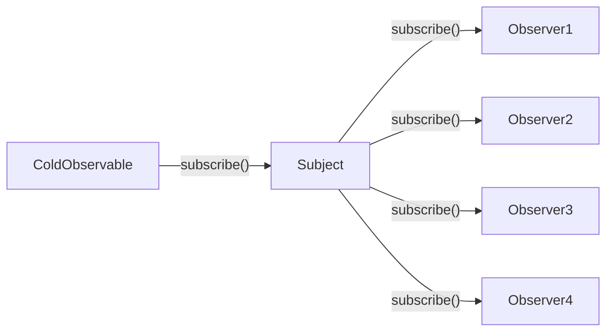

<template v-slot:default>

# Subject


</template>
<template v-slot:right>

Example:
https://stackblitz.com/edit/dde1ro?devtoolsheight=50&file=index.ts

```ts {}
import { Subject } from 'rxjs';

const subject = new Subject<number>();

subject.subscribe({
  next: (x) => console.log('ObserverA: ' + x),
  error: (err) => console.error('ObserverA: ' + err),
  complete: () => console.log('ObserverA got a complete notification'),
});
subject.subscribe({
  next: (x) => console.log('ObserverB: ' + x),
  error: (err) => console.error('ObserverB: ' + err),
  complete: () => console.log('ObserverB got a complete notification'),
});

subject.next(1);
subject.next(2);
subject.complete();
```

</template>

<!--
1. Subject的作用就是将Cold Observable转换为Hot Observable，从而实现真正意义上的多播。
2. 从图中可以看到，Subject可以订阅Cold Observable，那说明，Subject本身就是一个Observer。
3. 还可以看到，Subject又可以被其他的observer来订阅，那说明，Subject本身还是一个Observable。
4. 所以说， Subject是rxjs中一个比较特殊的存在，它即是一个Observable也是一个Observer。
5. 从图中，可以看出， 因为Cold Observer只被Subject订阅了一次，那就保证里，只产生了一个数据流，Subject会将这个数据流中的数据一致地广播到所有observer对象，从而实现了真正意义上的多播。
6. 还有一个概念是广播：
   a. Rxjs中是不支持广播的概念，因为广播还涉及到频道互占，干扰等问题，Rxjs并没有设计于此。
7. 但是似乎看起来好麻烦，如果每次都需要开发人员自己新建subject 对象，然后订阅等。 而rxjs已经为我们提供了多播操作符，操作符已经完成了新建subject和订阅上游的操作，我们可以直接拿来使用。
-->
