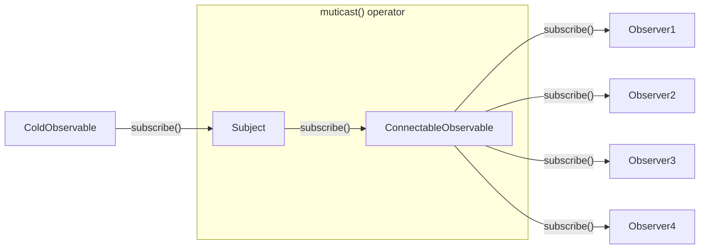
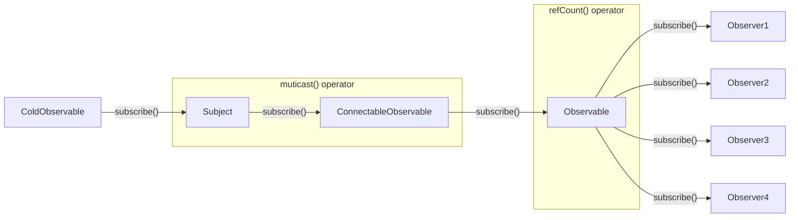

# Multi Operators - multicast()

[Rxjs Guide](https://rxjs.dev/guide/subject#multicasted-observables)

- Question 1: why does muticast() return a new ConnectableObserver object?
- Question 2: Why do we need to call muticast().connect() method to start the execution?
- Question 3: Custom Observable vs ConnectableObserver?

<!--
1. Q1 - 首先来看第一个操作符， multicast(), 如果它会新建subject，将subject订阅上游observable，最后它会返回一个connectableObservable(就是rxjs提供的一observable子类),用于下游的observer对象去订阅，实现多播，那大家会有一个疑问：为什么还有返回一个observable对象呢，Subject本身就是一个observable对象，observer对象可以直接定义它就好了。
2. Q1 Answer - 我们再看前面的subject例子中，可以看到，我们可以直接调用subject对象的next()，complete()方法。 如果multicast()操作符直接返回subject对象，那在我们的业务代码中也可以调用这些方法，它们会直接讲整个数据流更新为终结状态。这往往会引发不可预期的问题，所以，多播操作符会返回一个新的订阅了subject对象的observable对象来给我使用。
3. Q2 - 为什么需要调用connectableObservable对象的connect()方法。 只有在调用这个方法后，Subject对象才会正在去订阅上游的源头observable对象，才会让整个数据流流动起来。 这么做的意义是，控制数据流动的时机， 可以控制只在有observer对象订阅了，subject对象再去订阅上游，否则，是无意义的。
4. Q3 - 那必须一定要使用这个默认返回的connectableobservable吗，不是的，如果我们需要有一个自定义的observerable，我们可以自己定义，multicast(subject, selector) 操作符实际提供了两个参数， 第一个参数是必填的，第二是一个”函数“，它是选填的。 如果指定了第二个参数，就说明，我们有定制的observerable。
5. Q3 - 这个selector函数，只有一个参数用来接收subject对象，它最终需要返回一个新的订阅了subject的observable对象。那有什么意义呢， 有一个observable的”三角关系问题“就可以通过这种方式来解决。 三角关系问题是，一个coldobserverable对象， 一个coldobservable.pipe(dealy(1000)) 对象， 一个合并了前两个observable对象的observable对象，问题是第一个coldobservable对象会被订阅两次，发送两遍数据，在具体业务场景中，这是完全没有必要的，那就可以通过这个selector函数通过中介subject对象来解决。
6. subject对象用来订阅coldobservable对象一次，所以保证了coldobservable不会被订阅多次，同时使用subject最为中介人，与另外两个observable对象组成三角关系，因为subject是hot observerable，可以实时的将数据发送给他俩就没有问题了，最终，selector函数返回最终合并的参数。
-->

---

# Multi Operators - multicast() -> refCount()

<!--
1. 那直接使用multicast()返回的connectableobservable对象看起来好麻烦，有没有一种机制，可以自动检测到当有observer订阅的时候，就自动的将subject对象订阅到上游的observable对象呢，并且在没有observer对象时候，就自动将subject对象退订呢。
2. 就是使用refCount()函数，就可以实现这种机制，它是connectableobservable对象的方法，调用后会返回一个新普通的observable对象，再用于下游的observer对象来订阅。
-->