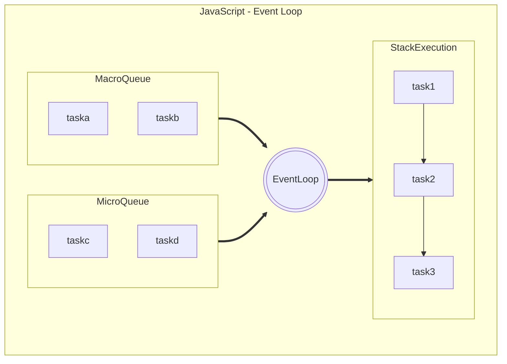

# 7 - Scheduler

---

# Javascripts Single-Threaded


<!-- 
1. Javascripts是单线程运行，不同于其他面向对象语言，是多线程实现异步编程。那js的异步编程是如何实现，就是通过事件轮询机制。
2. 回到我们之前说的例子中，如果有一个异步的http请求， 它会把这个任务先放到队列中，然后线程继续执行代码，直到完成后，事件轮询机制会在从队列中取出待运行的任务到线程的执行栈中，周而复始完成异步操作，这就是javascript的事件轮询机制来实现的异步编程。
3. js中的ajax请求，setTimeout(), setInterval()返回就会创建出异步任务，这些任务会被暂时放到队列中。
4. 事件队列中的任务可以分为Macro task和microtask， micro 队列就是一个VIP通道，会优先被放到执行队列中。
-->

---

# Rxjs Scheduler Objects

- default
- asapScheduler
- aysncScheduler
- queueScheduler

```ts {}

import { Observable, asapScheduler, observeOn } from 'rxjs';

const observable = new Observable((observer) => {
  observer.next(1);
  observer.next(2);
  observer.next(3);
  observer.complete();
}).pipe(observeOn(asapScheduler));

```

<!-- 
1. scheduler - 调度器的作用就是控制observable发送每一个数据的节奏，以同步方式还是异步方式发送，发送数据的时间等。
2. 我们之前用的创建类的操作符，其实都各自使用了scheduler，我们只是不知道它们的存在而已。在observer的onSubcribe()方法中，就会调用scheduler对象的schedule()方法来发送数据。
3. 一般情况下，对于没有指定scheduler的操作符就是默认以同步的方式发送数据，例如range()等， 但是interval()事件之类的操作符会使用asyncscheduler异步的发送数据。
4. rxjs提供了几种常用的scheduler对象，供我们使用。
5. asapScheduler - 是异步的方式发送数据，对应到上面的事件轮询机制中，对应的是micro task，所以会优先得到执行比macro task。
6. asyncScheduler - 也是异步的发送数据，它对应的就是macro task。
7. queueScheduler - 事业异步的发送数据， 它利用队列实现迭代大量数据并异步的发送数据。
8. 如果自定义scheduler，还可以控制发送的时间等等，但是， rxjs 提供的已经可以满足项目的使用，不用自己创建scheduler。
9. 使用scheduler，就很简单了，像上面例子中，使用observeOn()操作符就可以指定scheduler对象。
-->
